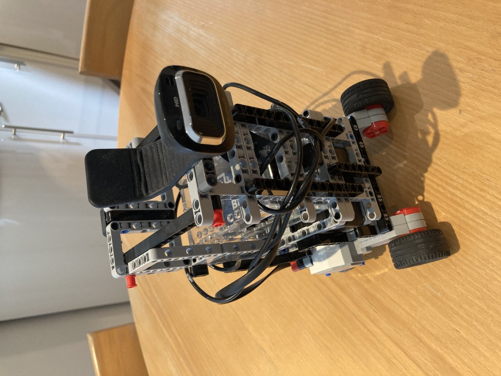
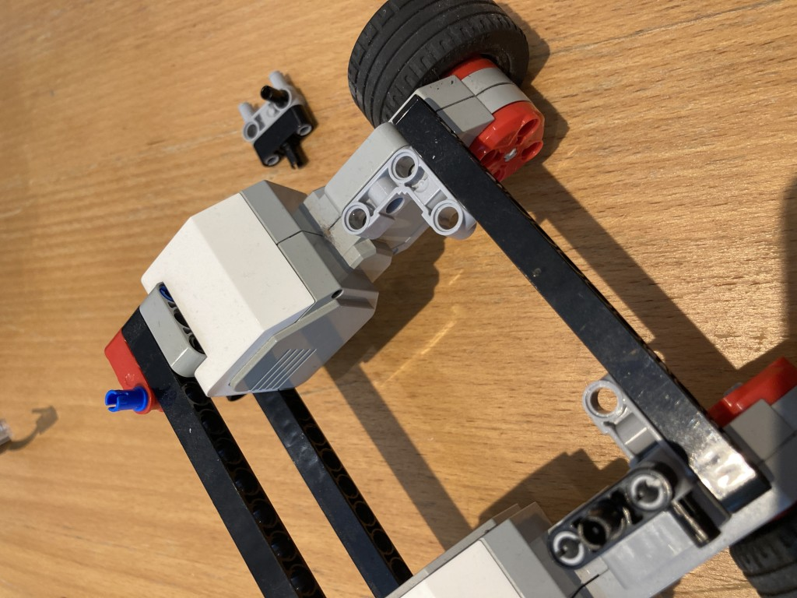
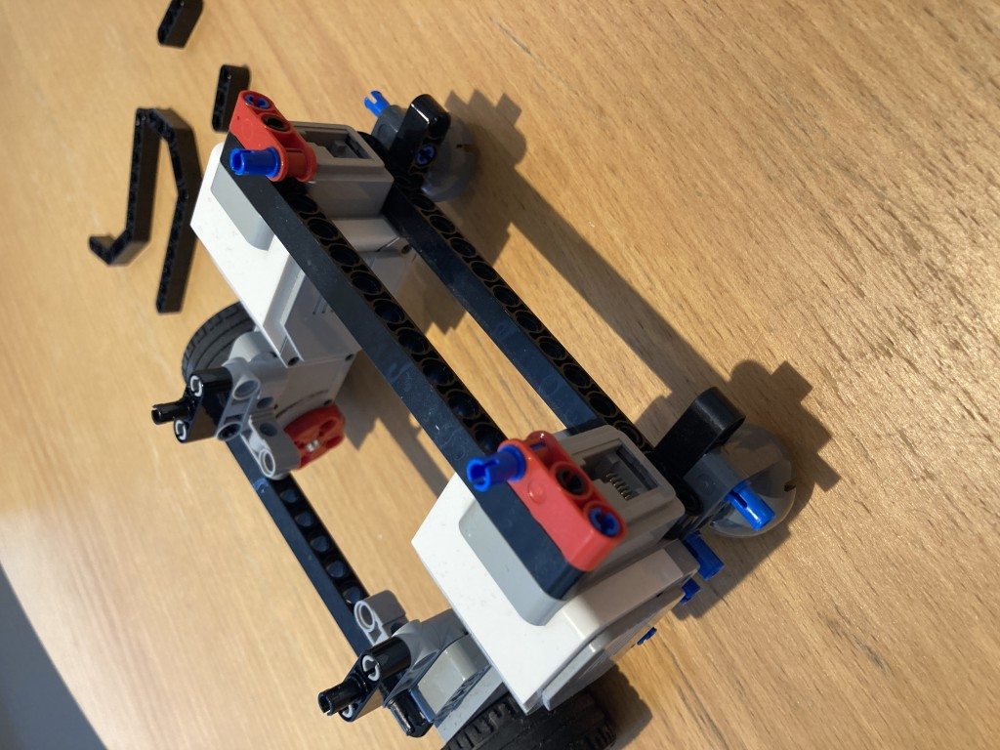
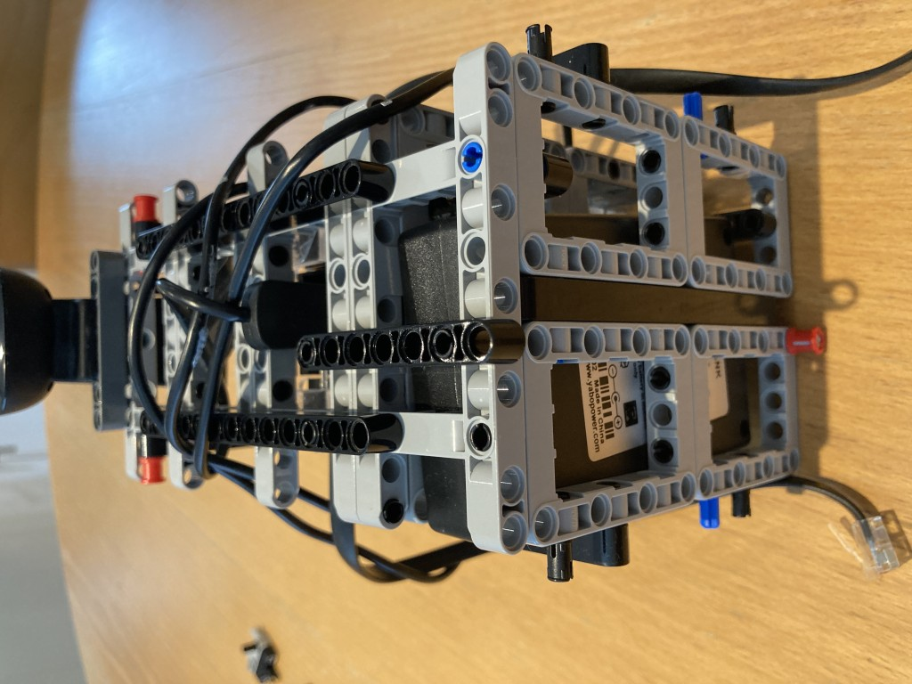
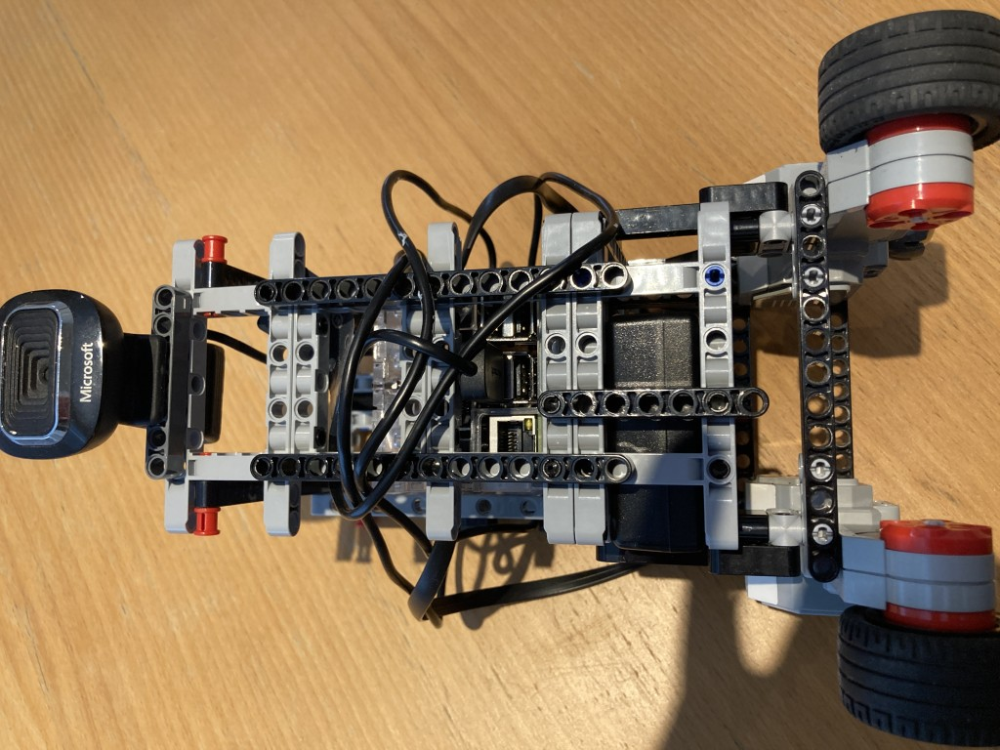
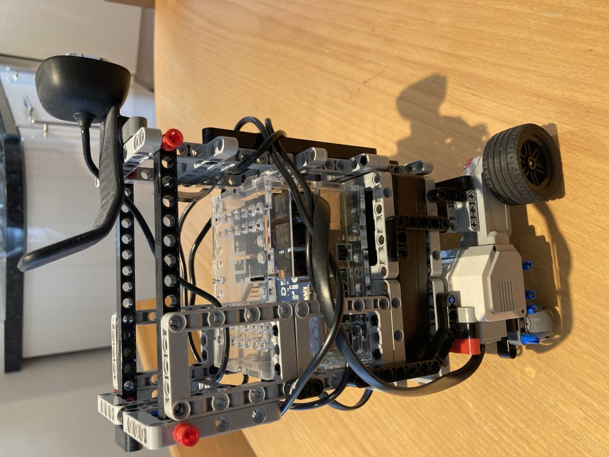
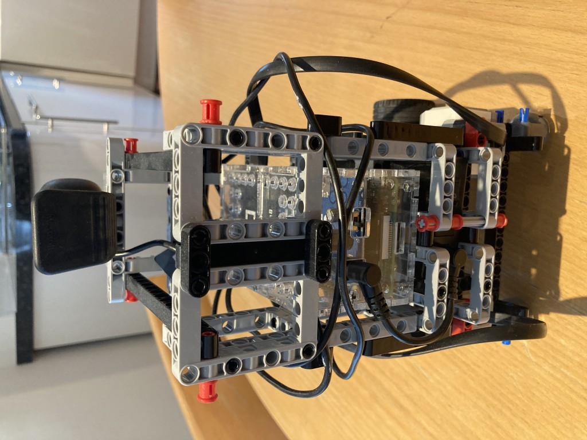
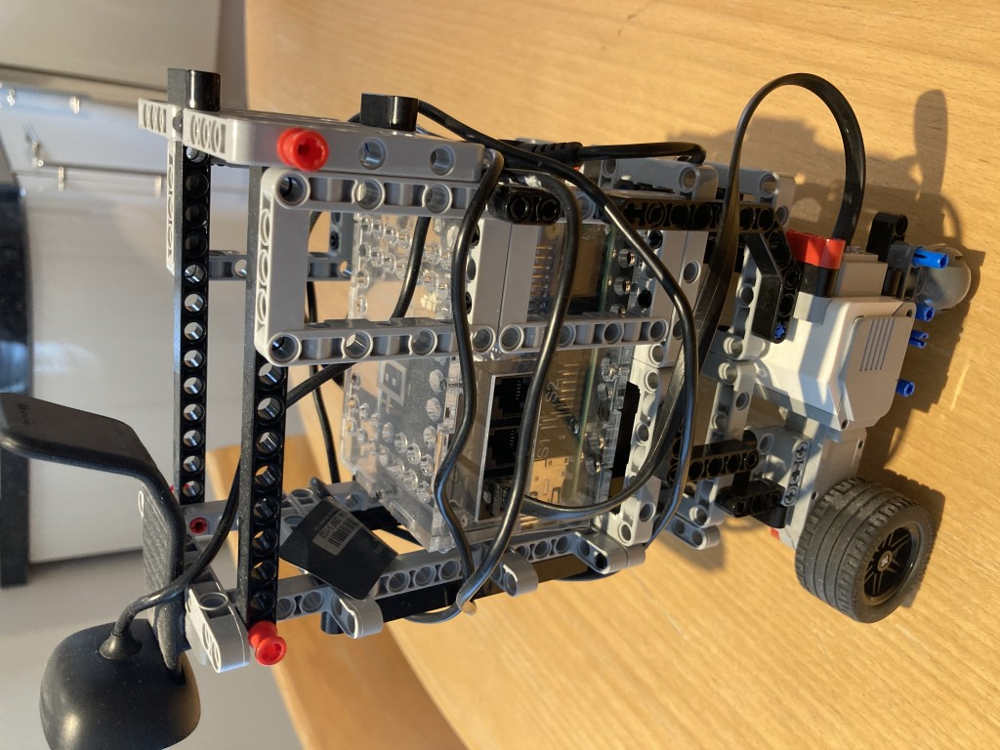
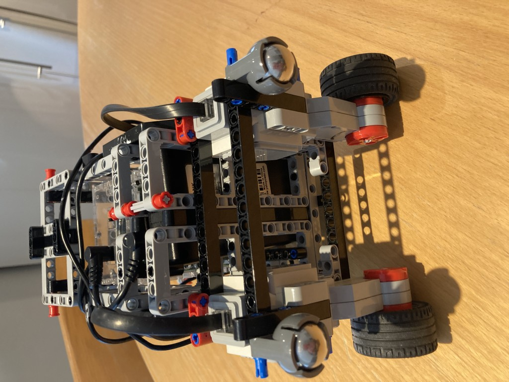

# Charlie The Robot

Here are some pictures that might be helpful in building a Charlie like robot.

Please note this is the latest version of Charlie that differs slightly from previous versions of Charlie that you might see, eg in the YouTube video. This version is more stable and robust, but is essentially the same.

# Accessorised Charlie

Here I have attached the EV3 Infrared sensor, and also the EV3 Ultrasonic distance sensor (this sensor is illuminated red when activated).
