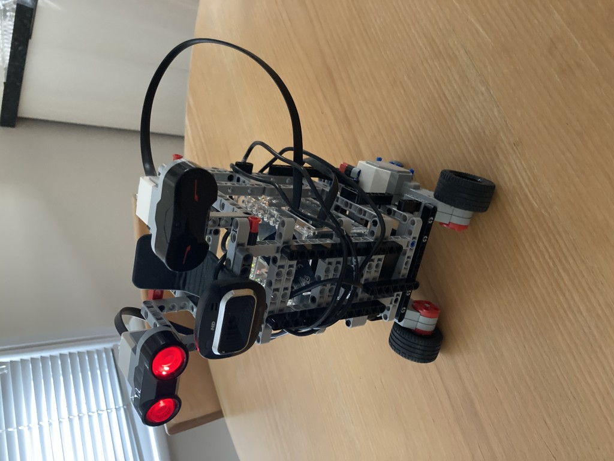

# Charlie The Robot

Charlie is just a minimalist demonstration robot, primarily to demonstrate how to control the motors.
It is expected that you will wish to use your own repository to manage your own robots.

Please note this is the latest version of Charlie that differs slightly from previous versions of Charlie that you might see, eg in the YouTube video. It has been redesigned to be more modular.


## Lego Assembly

[Lego Assembly Instructions](./lego_assembly/README.md)

## Installation

```
docker build -t charlie ./ros2_brickpi3/docker/charlie/
```
```
docker run -it --privileged --rm --network=host --ipc=host charlie
```

Charlie's configuration files are setup to assume BrickPi3 ports A and D are connected to the left and right EV3 motors respectively.

On another computer or shell window:
```
ros2 topic pub --once /cmd_vel geometry_msgs/msg/TwistStamped "{twist: {linear: {x: 0.1, y: 0.0, z: 0.0}, angular: {x: 0.0, y: 0.0, z: 0.0}}}"
```
This should cause the motors to rotate (briefly).

To control by keyboard:

```
ros2 run teleop_twist_keyboard teleop_twist_keyboard --ros-args -p stamped:=true
```

To control by joystick:

You can use the ros2 teleop-twist-joy package to control by joystick. The repo https://github.com/jfrancis71/ros2_joystick_config/ contains examples for a XEOX Gamepad joystick.

# Accessorised Charlie



Here I have attached the EV3 Infrared sensor, and also the EV3 Ultrasonic distance sensor (this sensor is illuminated red when activated).
