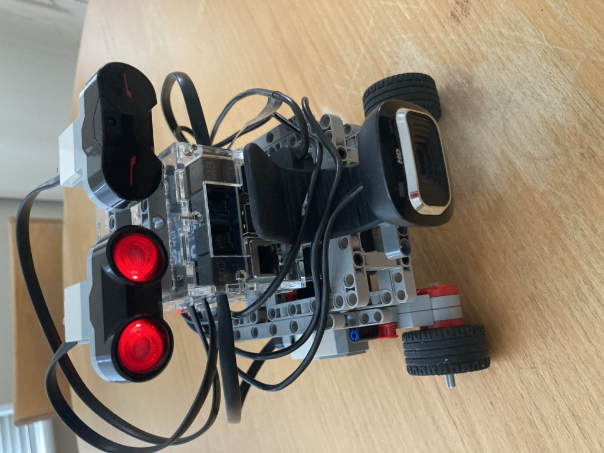

# Charlie The Robot

Charlie is just a minimalist demonstration robot, primarily to demonstrate how to control the motors.
It is expected that you will wish to use your own repository to manage your own robots.

Please note this is the latest version of Charlie that differs slightly from previous versions of Charlie that you might see, eg in the YouTube video. It has been redesigned to be more modular.


## Lego Assembly

[Lego Assembly Instructions](./lego_assembly/README.md)

## Installation

Charlie uses the ROS2 control Differential Drive controller to manage the hardware interface to the motors.
Therefore for this you will need to install:

```
mamba install ros-jazzy-diff-drive-controller
source ./install/setup.bash  # source the ROS2 workspace again
```

To start the differential drive controller, run:
```
ros2 launch brickpi3_charlie brickpi3_motors_launch.py
```
Charlie's configuration files are setup to assume BrickPi3 ports A and D are connected to the left and right EV3 motors respectively.

On another computer or shell window:
```
ros2 topic pub --once /cmd_vel geometry_msgs/msg/TwistStamped "{twist: {linear: {x: 0.1, y: 0.0, z: 0.0}, angular: {x: 0.0, y: 0.0, z: 0.0}}}"
```
This should cause the motors to rotate (briefly).

For robots with other types of drive mechanisms, eg ackermann, you should install the appropriate ROS2 controller.

To control by keyboard:

```ros2 run teleop_twist_keyboard teleop_twist_keyboard --ros-args -p stamped:=true```

To control by joystick:

Note the DiffDrive controller interprets twist messages in metric, so need to scale joystick (otherwise the speed commands will be far to fast for Charlie to be safe with). The below config file is based off the teleop_twist_joy/confix/xbox.config.yaml, but modified to scale linear.x
You may need to alter depending on your joystick model:

```ros2 launch teleop_twist_joy teleop-launch.py config_filepath:=./src/ros2_brickpi3/brickpi3_charlie/config/xeox.config.yaml publish_stamped_twist:=true```


# Accessorised Charlie



Here I have attached the EV3 Infrared sensor, and also the EV3 Ultrasonic distance sensor (this sensor is illuminated red when activated).
