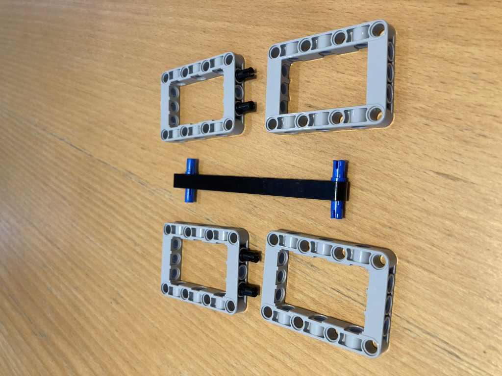

# Battery Holder Assmembly

I have added the battery, and you can see the above beam of length 2 attached just by the front of the battery. There is only one friction pin on this beam and it acts as a toggle, allowing you to insert/remove battery and lock it in place.
