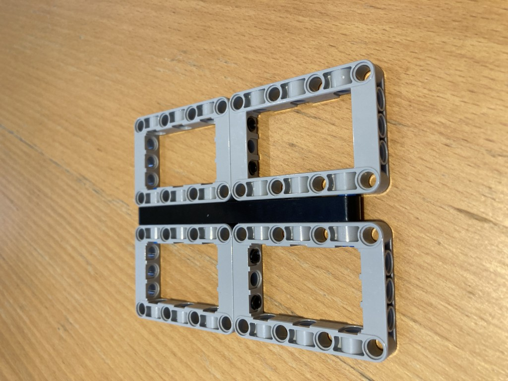
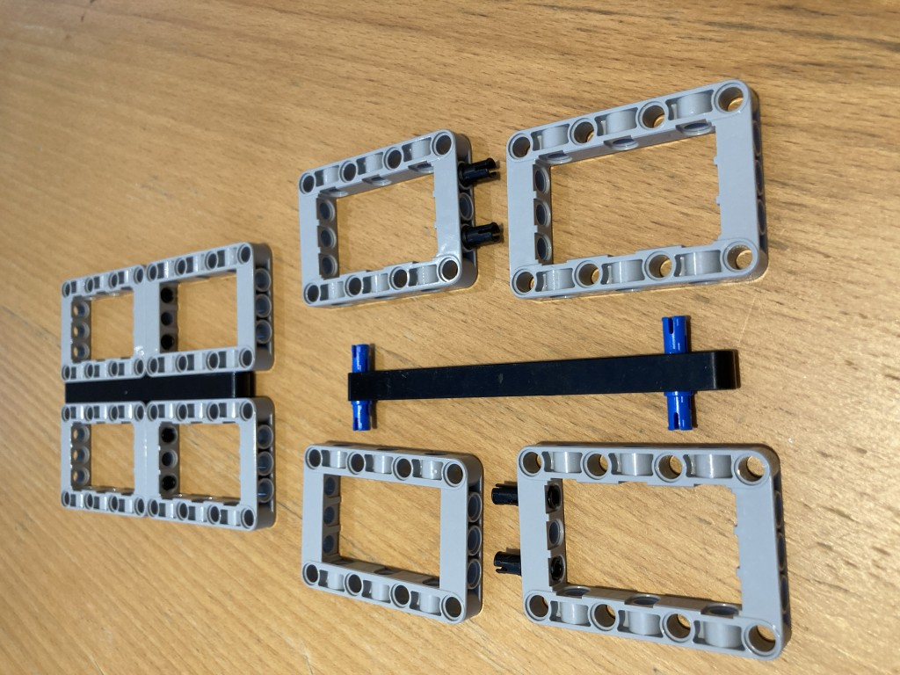
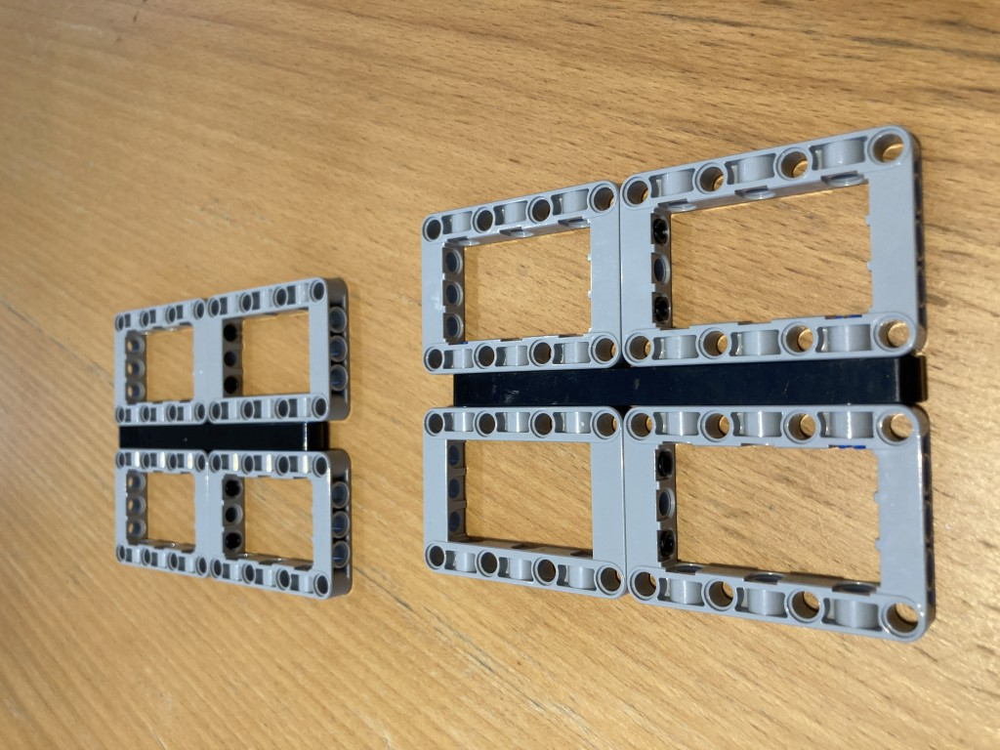
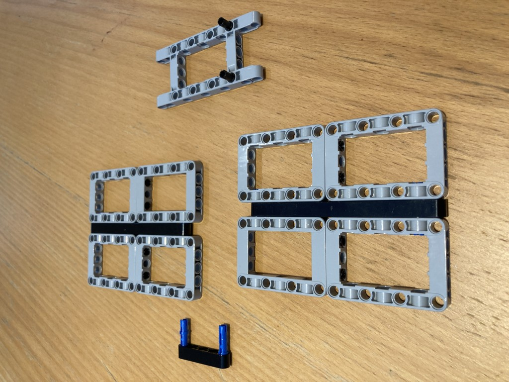
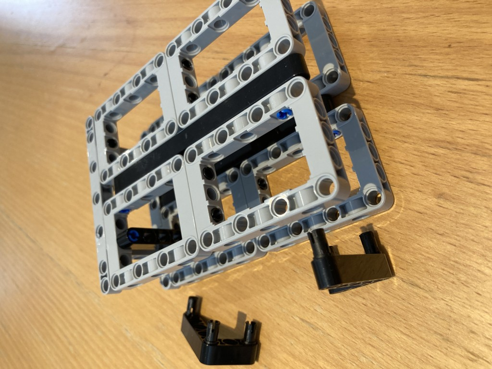
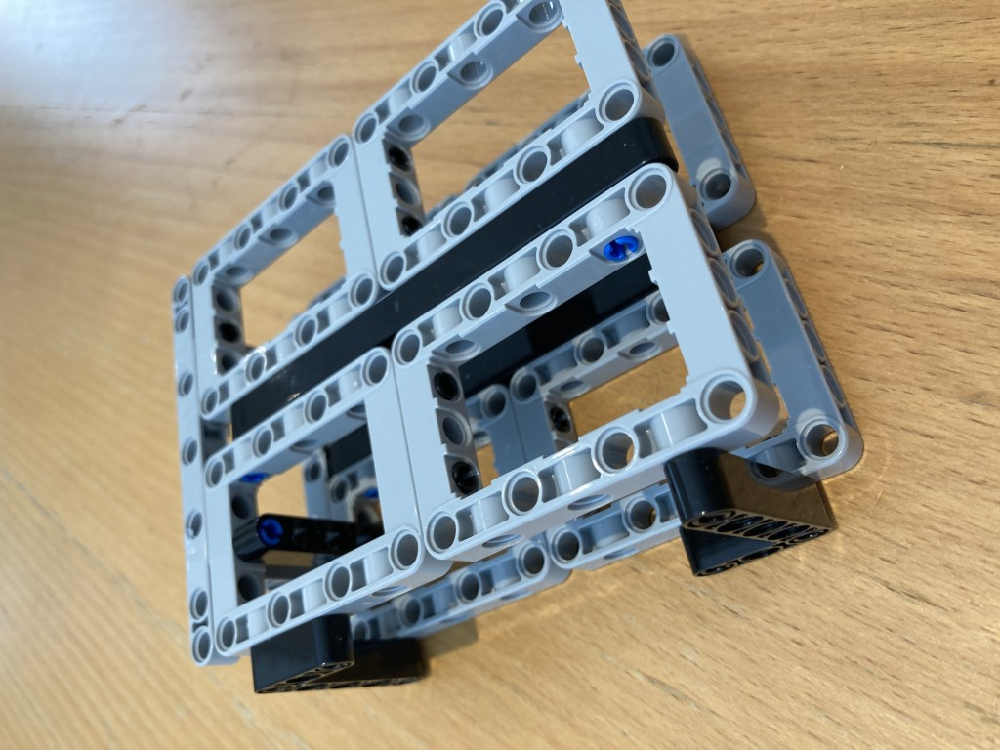
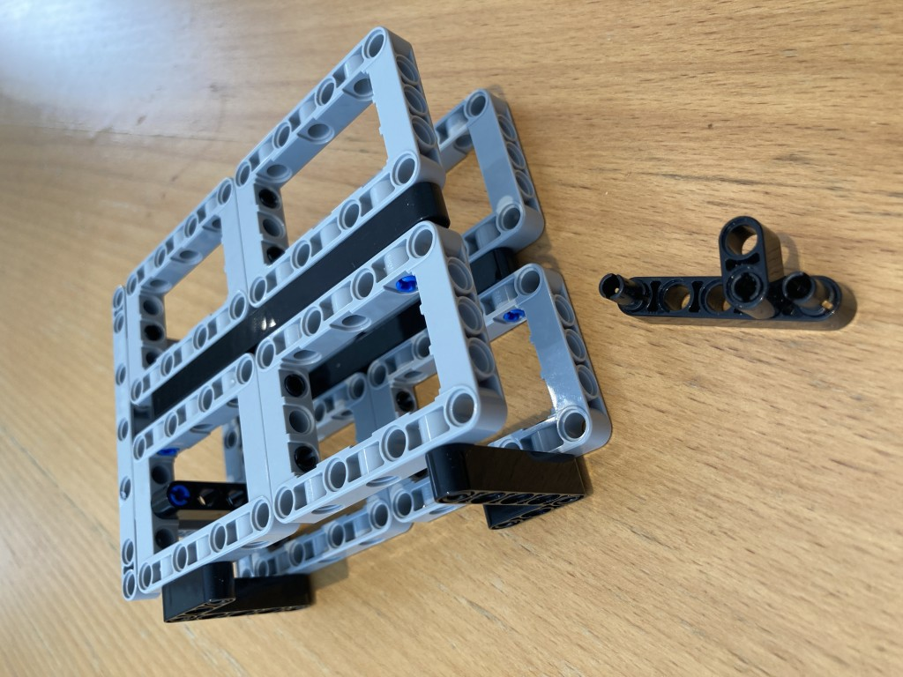

# Battery Holder Assmembly

Although here you can insert the battery from the right hand side, this will be closed off by further assembly. Note the 5 beam added in the previous step has a small beam of length 2 attached with a friction pin. This acts as a toggle allowing easy insert/remove battery (from the front) and to lock it in place.
