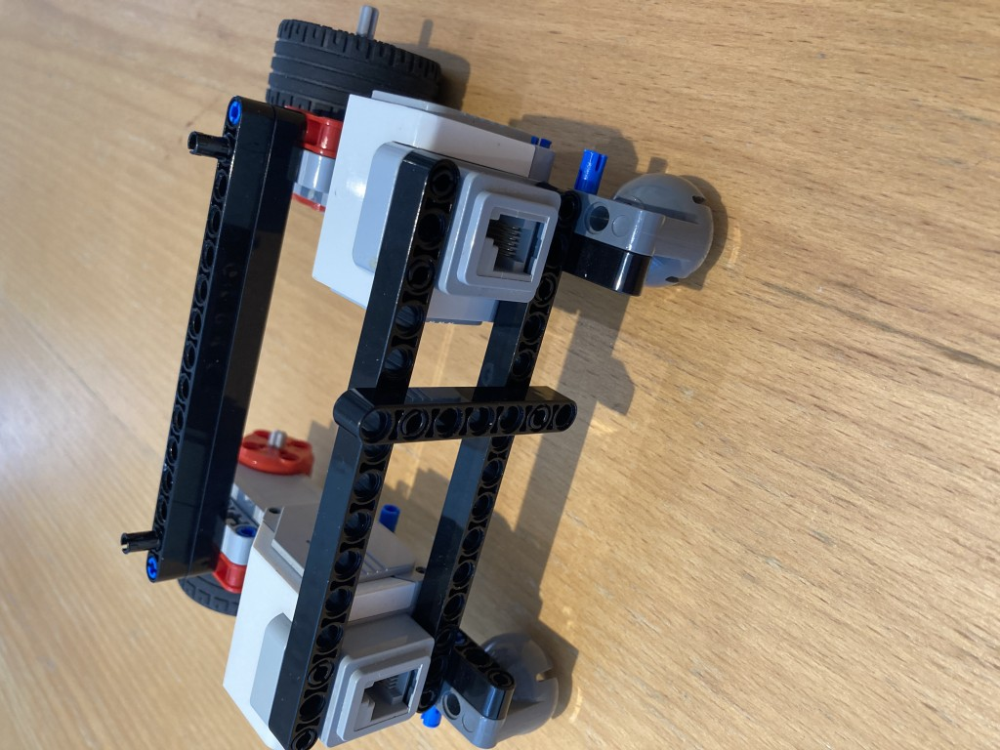
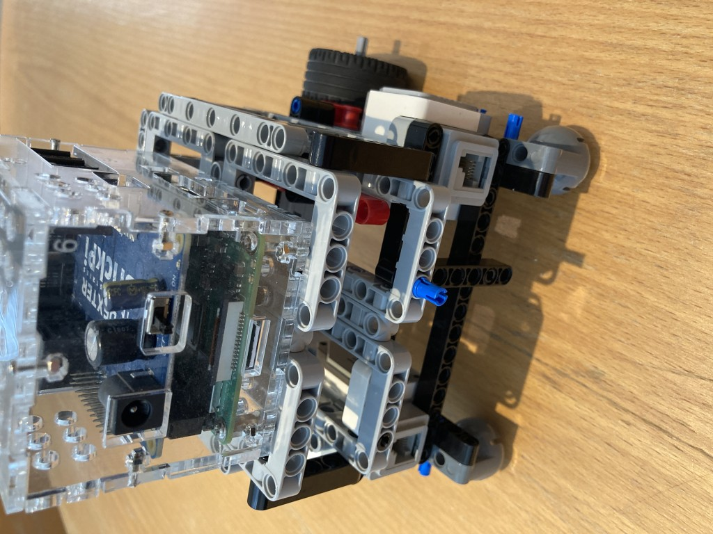
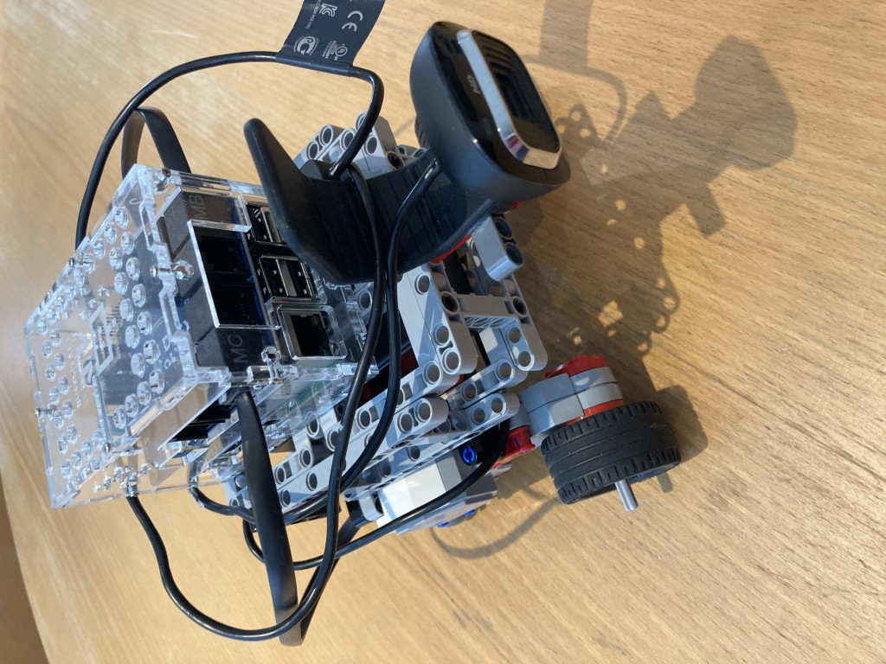

# Final Assemble of Charlie

Time to wire up...The left wheel goes to PORT_A and right wheel to PORT_D.
You can change this if you wish, providing you change the robot_description.yaml config file correspondingly.

