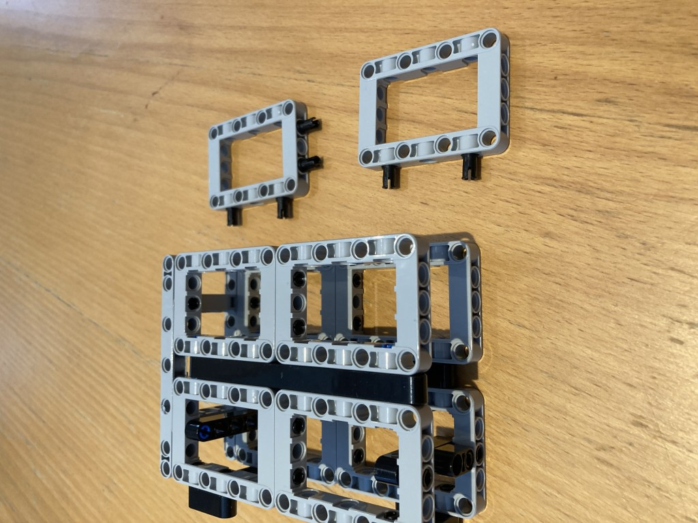
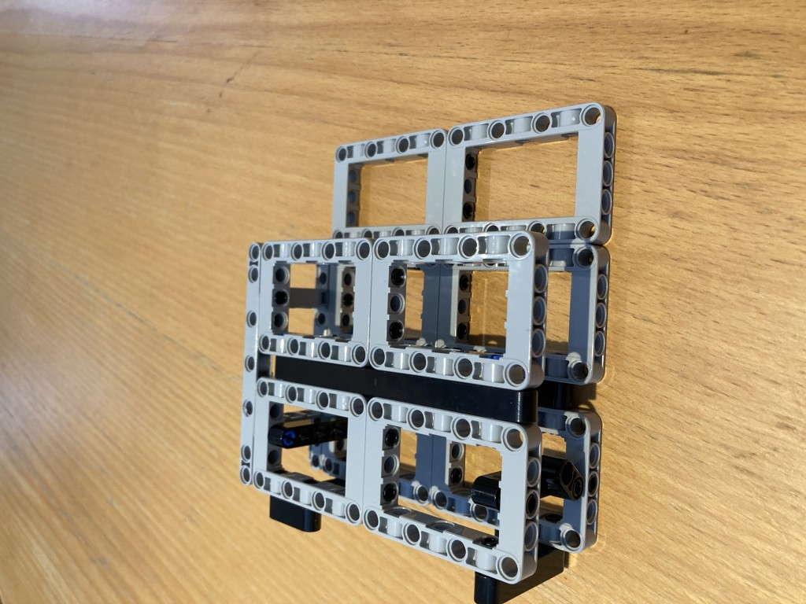
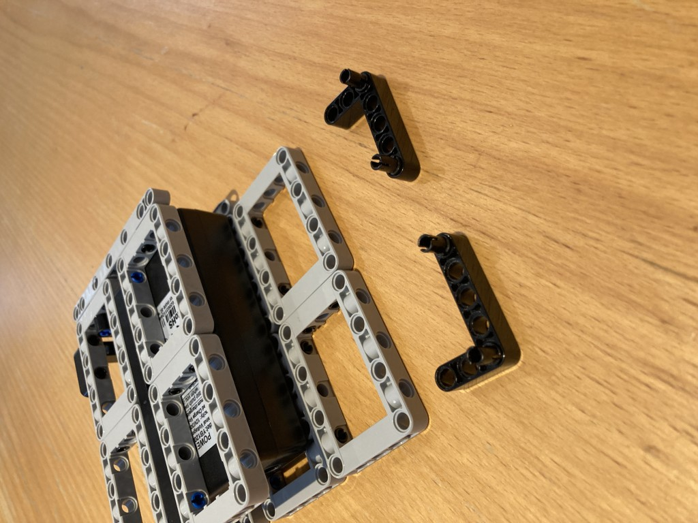
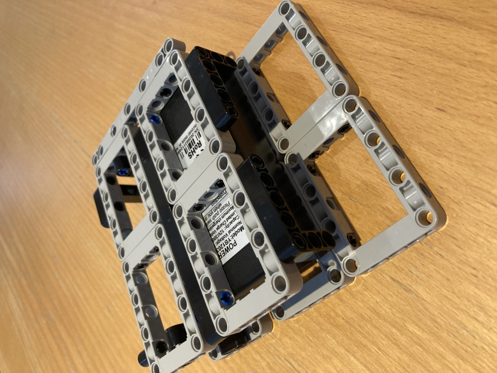
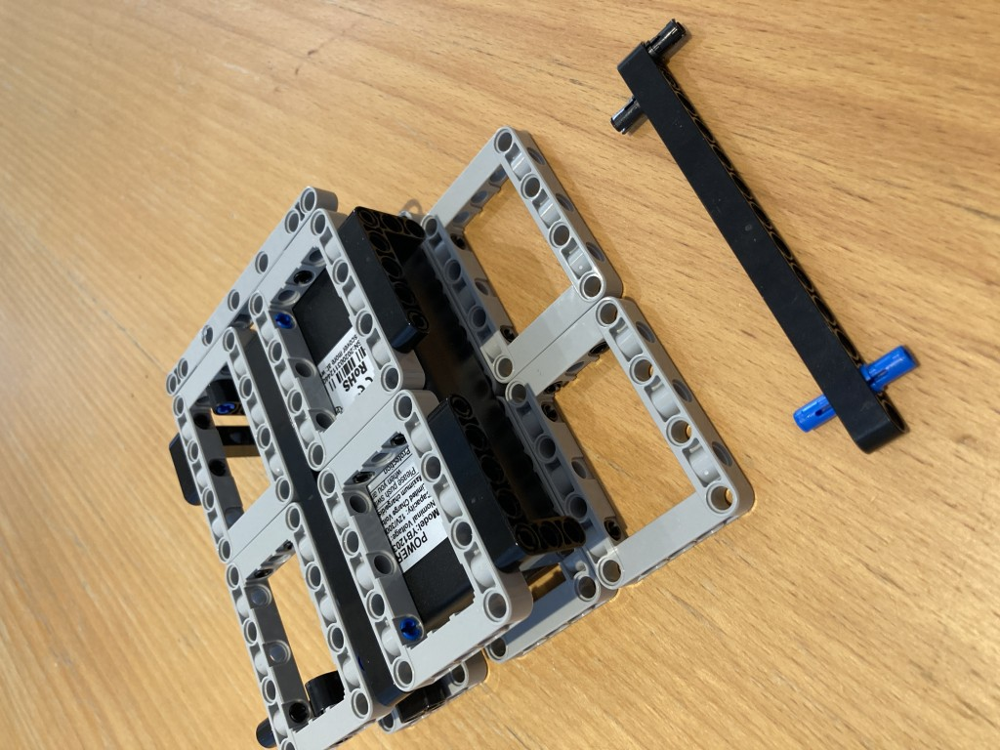
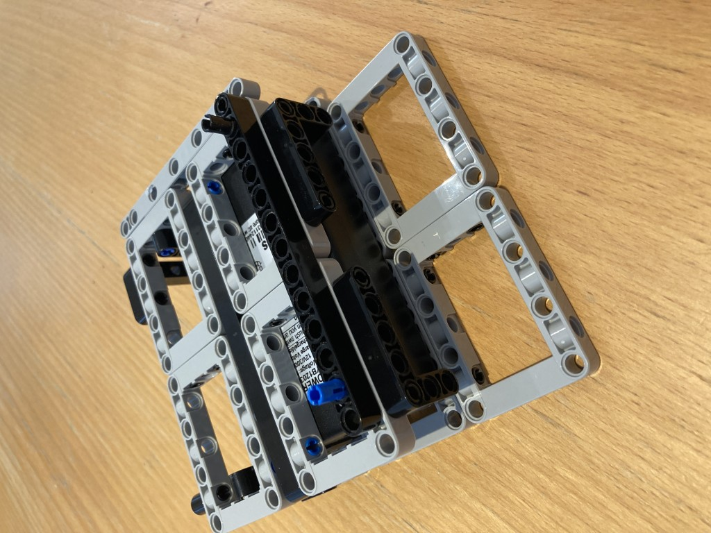
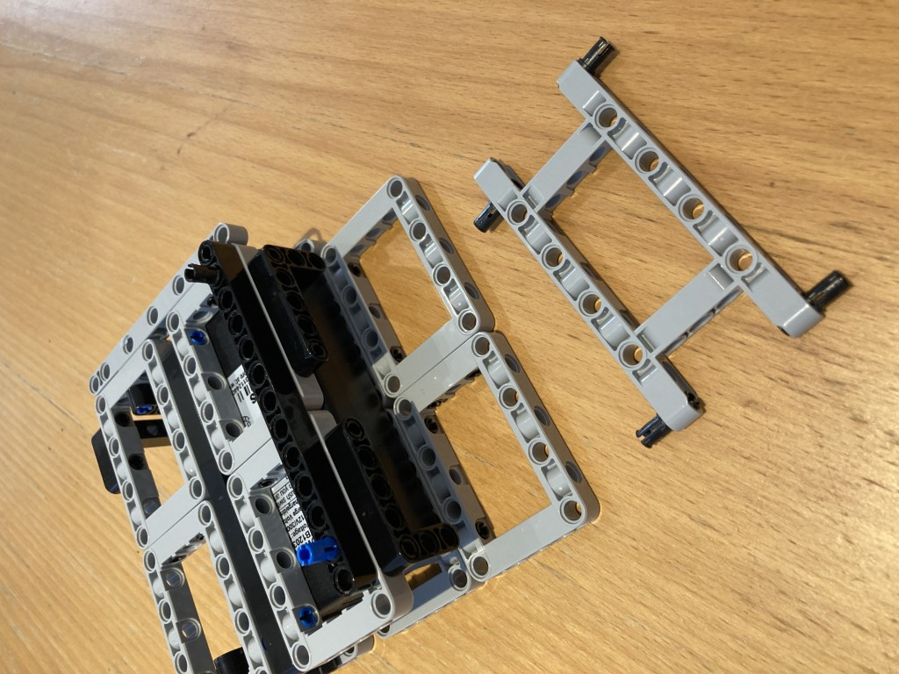
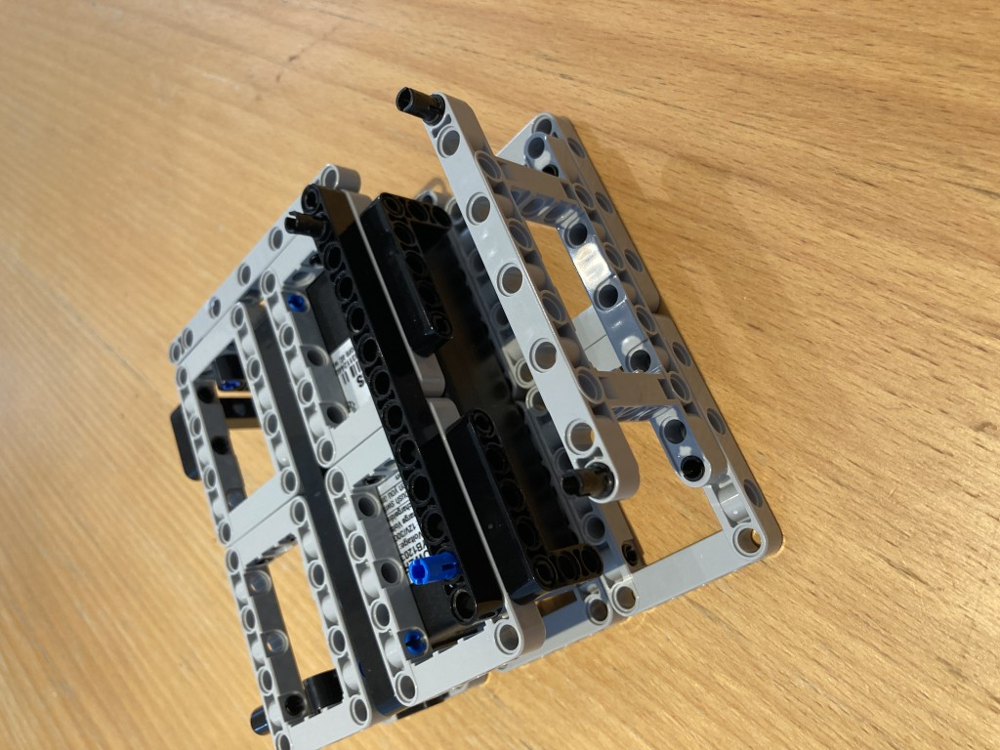
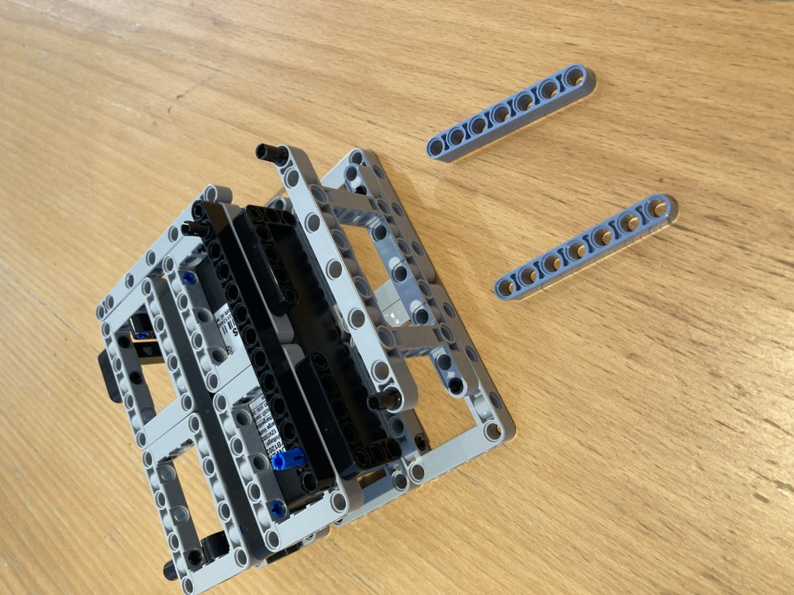
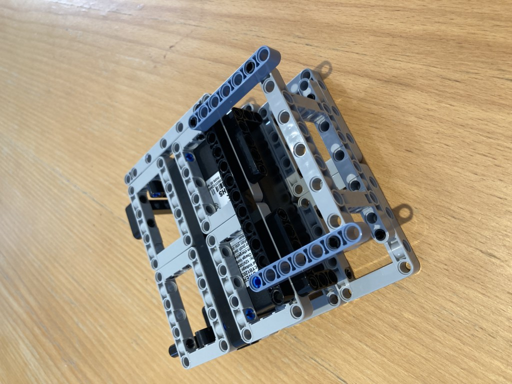

# Front Mount

These steps are not strictly necessary. I use the frame to attach a camera. However it is nice to have something added here (possibly just decorative) to break the symmetry of the robot, so you know which way is the "front".

