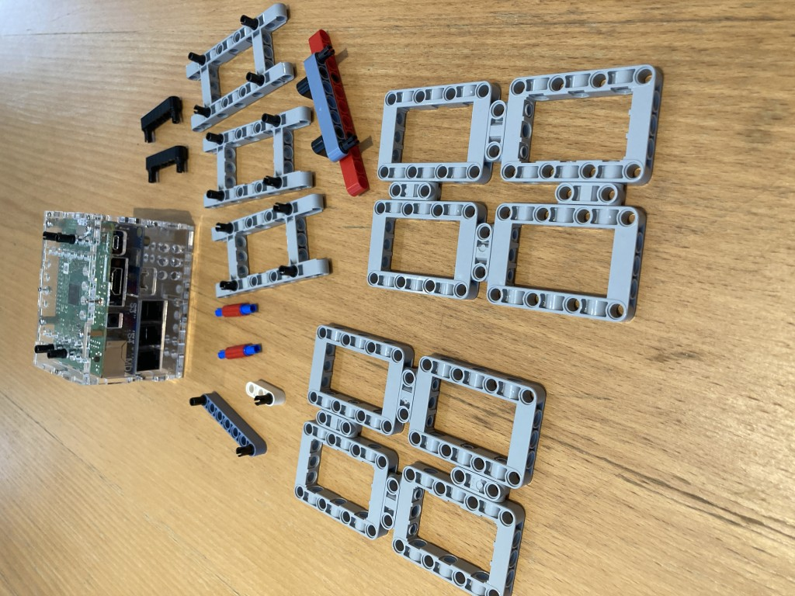
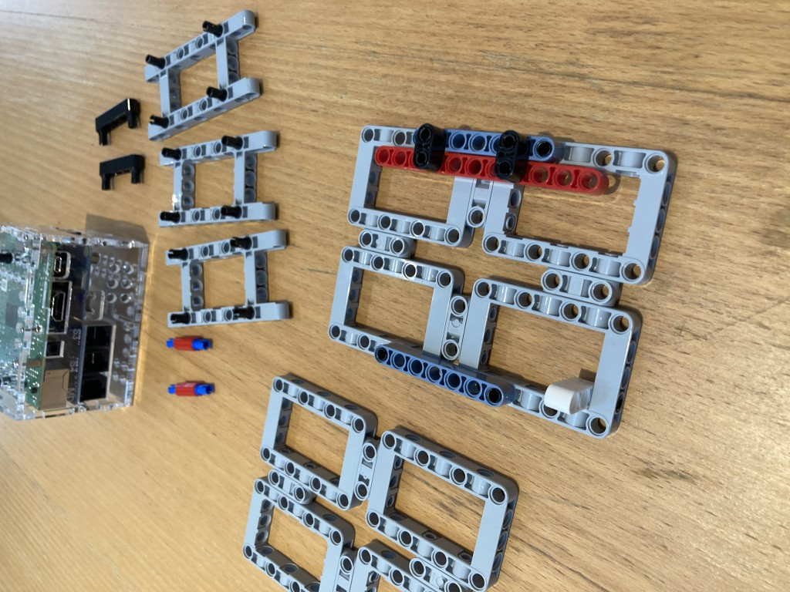

# System Assembly Instructions

This is basically the upper part of the robot, consists of battery holder, BrickPi3 attachments. It is hoped this should be fairly modular, facilitating reuse by different robot designs.

The white beam of length 3 acts as a toggle to insert/lock battery in place. It is friction based providing a reasonable trade off between convenience and ruggedness.
